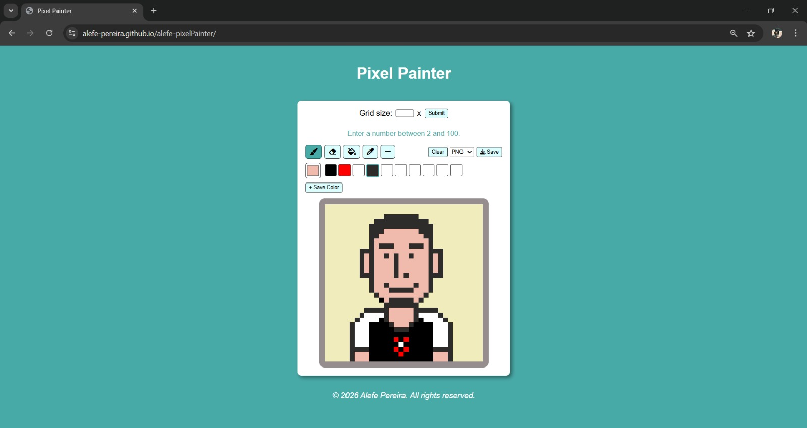

# 🎨 Pixel Painter

> A browser-based pixel art editor built with vanilla HTML, CSS, and JavaScript — no frameworks, no dependencies.

<br>

## 🌐 Live Preview

🔗 **[Preview Link→](https://alefe-pereira.github.io/alefe-pixelPainter/)**

<br>

## 📸 Screenshot

<!-- Add a screenshot of the project here -->
 

<br>

## ✨ Features

### 🖌️ Drawing Tools
| Tool | Description |
|------|-------------|
| **Brush** | Freehand painting — click or drag to color cells |
| **Eraser** | Removes color from individual cells |
| **Fill Bucket** | Flood-fills a connected region using the Bresenham-adjacent algorithm |
| **Eyedropper** | Picks the color of any painted cell and sets it as the active color |
| **Straight Line** | Draws a pixel-perfect line between two points using the Bresenham line algorithm |

### 🎨 Color System
- Native browser **color picker** for selecting any color
- **Godet (color palette)** with 10 save slots for favorite colors
- Single-click a slot to activate its color
- Double-click a slot to remove it
- Color picker auto-syncs with the active godet slot

### 🗂️ Canvas
- Fully **customizable grid size** — any value from 2×2 to 100×100
- Defaults to a **10×10 grid** on first load
- **Color preview** outline appears on hover before painting
- **Undo** support via `Ctrl + Z`
- **Clear** button resets the entire canvas instantly

### 💾 Export
Export your pixel art in three formats:
- **PNG** — with full transparency support
- **JPEG** — with white background fill
- **WebP** — optimized for web

Each cell is rendered at 10px in the exported file, resulting in a pixel-perfect output.

<br>

## 🗂️ Project Structure

```
pixel-painter/
├── index.html      # App structure & semantic markup
├── style.css       # Layout, theming, and component styles
└── script.js       # All app logic and interactivity
```

<br>

## 🧠 Technical Highlights

- **Zero dependencies** — pure vanilla JavaScript, HTML5, and CSS3
- **Flood Fill** implemented recursively, tracing connected cells of the same color
- **Bresenham's Line Algorithm** for rasterizing straight lines on a discrete grid
- **Canvas export** uses an offscreen `<canvas>` element to convert `<div>` pixels to an image via `toDataURL()`
- **State management** via a single centralized `state` object, keeping tool, color, and draw mode in sync
- **RGB → Hex conversion** utility to bridge the browser's `rgb()` color format and the native color input's `#hex` format
- **Event delegation** on all dynamically created grid cells to support grids of any size

<br>

## 🚀 Getting Started

No build step required. Just open the file in any modern browser:

```bash
# Clone the repository
git clone https://github.com/YOUR_USERNAME/pixel-painter.git

# Open in browser
open index.html
```

Or simply download the three files and open `index.html` locally.

<br>

## 🕹️ How to Use

1. **Set grid size** — type a number (2–100) in the input field and click **Submit**
2. **Pick a color** — use the color picker on the left of the palette
3. **Save colors** — click **+ Save Color** to store a color in a godet slot
4. **Select a tool** — choose from the toolbar (brush is active by default)
5. **Draw** — click or drag across the grid to paint
6. **Undo** — press `Ctrl + Z` to revert the last stroke
7. **Export** — choose a format from the dropdown and click **Save**

<br>

## 🛠️ Browser Support

Works in all modern browsers that support:
- CSS Flexbox
- `<input type="color">`
- Canvas API (`toDataURL`)
- Optional chaining (`?.`)

<br>

## 👤 Author

**Alefe Pereira** · © 2026 · All rights reserved.